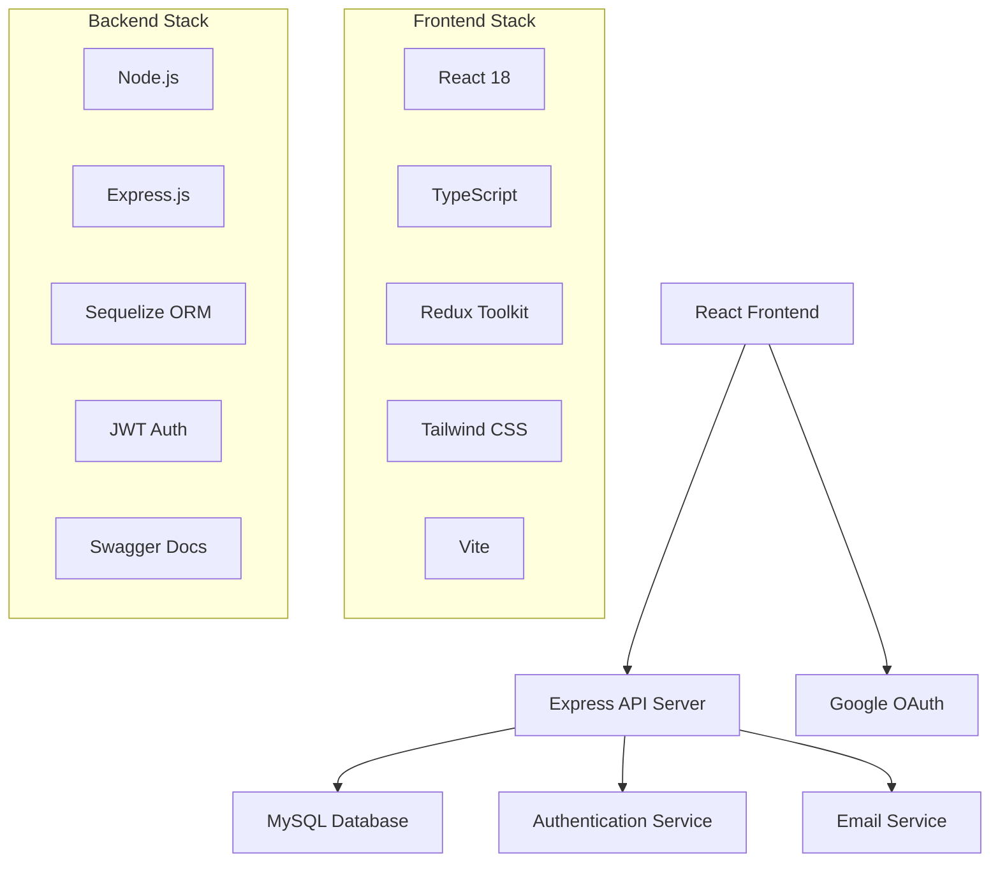

# 🍽️ Food Delivery Platform

<div align="center">


**A modern, full-stack food delivery platform built with React, Node.js, and TypeScript**

[🚀 Live Demo](#) • [📖 Documentation](#documentation) • [🐛 Report Bug](../../issues) • [✨ Request Feature](../../issues)

</div>

---

## ✨ Features

### 🎯 Core Functionality
- **🏪 Restaurant Management** - Complete restaurant onboarding and menu management
- **🛒 Smart Shopping Cart** - Persistent cart with real-time updates
- **📱 Responsive Design** - Seamless experience across all devices
- **🔐 Authentication** - Secure Google OAuth integration
- **💳 Order Processing** - End-to-end order management system
- **📍 Location Services** - Area-based restaurant discovery

### 🎨 User Experience
- **⚡ Lightning Fast** - Optimized performance with Vite and modern bundling
- **🎭 Interactive UI** - Smooth animations and transitions
- **🔍 Smart Search** - Advanced filtering and categorization
- **📊 Real-time Updates** - Live order tracking and status updates
- **♿ Accessibility** - WCAG compliant design

### 🛠️ Technical Excellence
- **🏗️ Modular Architecture** - Clean, maintainable codebase
- **🧪 Comprehensive Testing** - Unit, integration, and E2E tests
- **📚 API Documentation** - Swagger/OpenAPI integration
- **🔒 Security First** - Helmet.js, CORS, and input validation
- **📈 Scalable Database** - Sequelize ORM with MySQL

---

## 🏗️ Architecture



---

## 🚀 Quick Start

### Prerequisites

Ensure you have the following installed:
- **Node.js** (v18 or higher)
- **npm** or **yarn**
- **MySQL** (v8.0 or higher)
- **Git**

### 🔧 Installation

1. **Clone the repository**
   ```bash
   git clone https://github.com/yourusername/food-delivery-platform.git
   cd food-delivery-platform
   ```

2. **Install dependencies**
   ```bash
   # Install server dependencies
   cd server
   npm install
   
   # Install client dependencies
   cd ../client
   npm install
   ```

3. **Environment Setup**
   
   Create `.env` files in both `server` and `client` directories:
   
   **Server (.env)**
   ```env
   # Database Configuration
   DB_HOST=localhost
   DB_PORT=3306
   DB_NAME=food_delivery
   DB_USER=your_username
   DB_PASSWORD=your_password
   
   # JWT Configuration
   JWT_SECRET=your_super_secret_jwt_key
   JWT_EXPIRES_IN=7d
   
   # Google OAuth
   GOOGLE_CLIENT_ID=your_google_client_id
   GOOGLE_CLIENT_SECRET=your_google_client_secret
   
   # Email Configuration
   SMTP_HOST=smtp.gmail.com
   SMTP_PORT=587
   SMTP_USER=your_email@gmail.com
   SMTP_PASS=your_app_password
   
   # Server Configuration
   PORT=5000
   NODE_ENV=development
   ```
   
   **Client (.env)**
   ```env
   VITE_API_BASE_URL=http://localhost:5000/api
   VITE_GOOGLE_CLIENT_ID=your_google_client_id
   ```

4. **Database Setup**
   ```bash
   cd server
   
   # Run migrations
   npm run db:migrate
   
   # Seed the database with sample data
   npm run seed
   ```

5. **Start the application**
   ```bash
   # Terminal 1: Start the server
   cd server
   npm run dev
   
   # Terminal 2: Start the client
   cd client
   npm run dev
   ```

6. **Access the application**
   - Frontend: http://localhost:5173
   - Backend API: http://localhost:5000
   - API Documentation: http://localhost:5000/api-docs

---

## 📁 Project Structure

```
food-delivery-platform/
├── 📁 client/                    # React frontend application
│   ├── 📁 src/
│   │   ├── 📁 components/        # Reusable UI components
│   │   ├── 📁 pages/            # Page components
│   │   ├── 📁 hooks/            # Custom React hooks
│   │   ├── 📁 store/            # Redux store configuration
│   │   ├── 📁 types/            # TypeScript type definitions
│   │   └── 📁 utils/            # Utility functions
│   ├── 📄 package.json
│   ├── 📄 vite.config.ts
│   └── 📄 tailwind.config.js
│
├── 📁 server/                    # Node.js backend application
│   ├── 📁 src/
│   │   ├── 📁 controllers/       # Request handlers
│   │   ├── 📁 models/           # Database models
│   │   ├── 📁 routes/           # API routes
│   │   ├── 📁 middleware/       # Custom middleware
│   │   ├── 📁 services/         # Business logic
│   │   ├── 📁 seeders/          # Database seeders
│   │   └── 📁 __tests__/        # Test files
│   ├── 📁 configs/              # Configuration files
│   ├── 📄 package.json
│   └── 📄 jest.config.js
│
├── 📄 README.md
└── 📄 .gitignore
```

---

## 🧪 Testing

### Running Tests

```bash
# Server tests
cd server
npm test                    # Run all tests
npm run test:unit          # Unit tests only
npm run test:integration   # Integration tests only
npm run test:e2e          # End-to-end tests

# Client tests
cd client
npm test                   # Run React tests
npm run test:watch        # Watch mode
```

### Test Coverage

```bash
# Generate coverage report
cd server
npm run test:coverage
```

---

## 📚 API Documentation

The API is fully documented using Swagger/OpenAPI. Once the server is running, visit:

**http://localhost:5000/api-docs**

### Key Endpoints

| Method | Endpoint | Description |
|--------|----------|-------------|
| `GET` | `/api/restaurants` | Get all restaurants |
| `GET` | `/api/restaurants/:id` | Get restaurant details |
| `POST` | `/api/auth/login` | User authentication |
| `POST` | `/api/orders` | Create new order |
| `GET` | `/api/orders/:id` | Get order details |

---

## 🛠️ Development

### Code Style

This project uses ESLint and Prettier for code formatting:

```bash
# Lint code
npm run lint

# Fix linting issues
npm run lint:fix

# Format code
npm run format
```

### Git Hooks

Pre-commit hooks ensure code quality:
- Runs ESLint
- Runs Prettier
- Runs type checking
- Runs tests

### Database Migrations

```bash
# Create new migration
npx sequelize-cli migration:generate --name migration-name

# Run migrations
npm run db:migrate

# Rollback migration
npx sequelize-cli db:migrate:undo
```

---

## 🚀 Deployment

### Production Build

```bash
# Build client
cd client
npm run build

# Build server
cd server
npm run build
```

### Docker Deployment

```bash
# Build and run with Docker Compose
docker-compose up --build

# Production deployment
docker-compose -f docker-compose.prod.yml up -d
```

### Environment Variables

Ensure all production environment variables are set:
- Database credentials
- JWT secrets
- OAuth credentials
- SMTP configuration

---

## 🤝 Contributing

We welcome contributions! Please see our [Contributing Guide](CONTRIBUTING.md) for details.

### Development Workflow

1. **Fork** the repository
2. **Create** a feature branch (`git checkout -b feature/amazing-feature`)
3. **Commit** your changes (`git commit -m 'Add amazing feature'`)
4. **Push** to the branch (`git push origin feature/amazing-feature`)
5. **Open** a Pull Request

### Code of Conduct

Please read our [Code of Conduct](CODE_OF_CONDUCT.md) before contributing.

---

## 📄 License

This project is licensed under the MIT License - see the [LICENSE](LICENSE) file for details.

---

## 🙏 Acknowledgments

- **React Team** - For the amazing React framework
- **Express.js** - For the robust web framework
- **Sequelize** - For the excellent ORM
- **Tailwind CSS** - For the utility-first CSS framework
- **All Contributors** - Thank you for your contributions!

---

## 📞 Support

- 📧 **Email**: support@fooddelivery.com
- 💬 **Discord**: [Join our community](https://discord.gg/fooddelivery)
- 🐛 **Issues**: [GitHub Issues](../../issues)
- 📖 **Wiki**: [Project Wiki](../../wiki)

---

<div align="center">

**Made with ❤️ by the Food Delivery Platform Team**

⭐ **Star this repo if you find it helpful!** ⭐

</div>